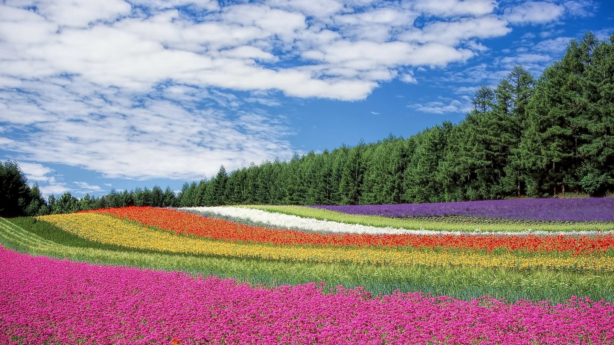
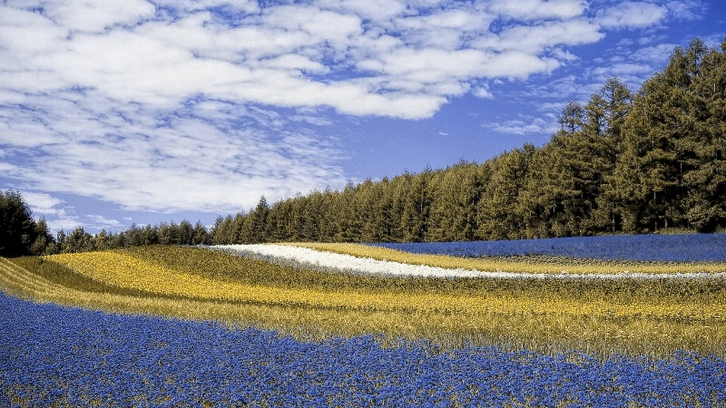
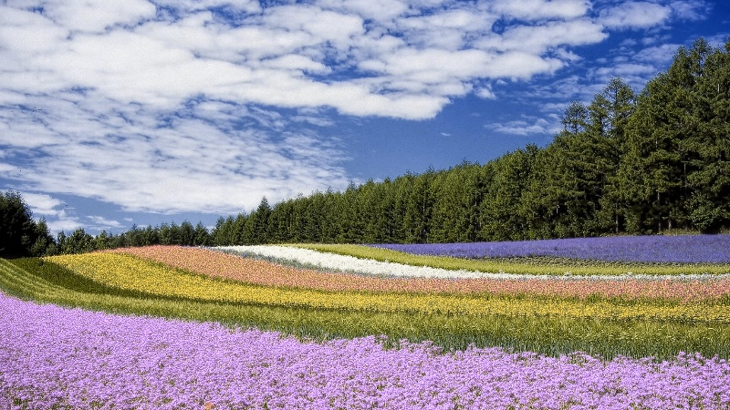

# Informe técnico — Simulación y corrección cromática para daltonismo

## 1. Introducción

Este proyecto fue desarrollado para la materia Técnicas de Procesamiento Digital de Imágenes. El objetivo principal es construir una aplicación en Python capaz de recibir una imagen real, procesarla mediante técnicas de procesamiento digital de imágenes y devolver nuevas imágenes transformadas que permitan analizar cambios en la percepción del color.

La problemática elegida es la dificultad que pueden tener algunas personas con daltonismo para distinguir ciertos colores en una imagen. A partir de esa problemática, el proyecto implementa una simulación de deficiencias cromáticas y una corrección orientada a mejorar la diferenciación visual entre colores.

El sistema no busca curar el daltonismo ni reemplazar una evaluación médica. Su finalidad es técnica y educativa: mostrar cómo una imagen digital puede modificarse mediante operaciones sobre sus canales de color.

## 2. Problema abordado

El daltonismo es una alteración en la percepción del color que puede dificultar la distinción entre determinados tonos. En imágenes digitales, esta dificultad puede observarse cuando ciertos colores que para una persona con visión normal resultan diferentes se vuelven parecidos para una persona con una deficiencia cromática.

El problema que aborda este proyecto consiste en procesar una imagen para:

1. simular cómo podría percibirse bajo un determinado tipo de daltonismo;
2. generar una versión corregida que aumente la diferenciación cromática;
3. permitir comparar visualmente la imagen original, la simulada y la corregida.

## 3. Objetivo del proyecto

El objetivo general es desarrollar una aplicación de procesamiento digital de imágenes que permita transformar una imagen de entrada mediante técnicas de simulación y corrección cromática.

Los objetivos específicos son:

* cargar una imagen real desde una fuente controlada del sistema;
* representar la imagen como una matriz de píxeles;
* aplicar transformaciones sobre los canales de color;
* simular distintos tipos de deficiencia cromática;
* generar una imagen corregida;
* guardar los resultados obtenidos;
* documentar el proceso técnico y las decisiones tomadas.

## 4. Enfoque técnico

El proyecto utiliza un enfoque determinístico basado en matrices de transformación cromática. Esto significa que no se entrena un modelo de inteligencia artificial, sino que se aplican operaciones matemáticas sobre los valores de los píxeles.

Una imagen digital en color puede representarse como una matriz tridimensional: alto, ancho y canales de color. Cada píxel contiene valores numéricos asociados a sus componentes cromáticas.

El procesamiento se realiza modificando esos valores mediante matrices. Estas matrices permiten transformar los canales de color para simular distintos tipos de daltonismo y generar una versión corregida de la imagen.

Este enfoque fue elegido porque es explicable, controlable y directamente relacionado con el procesamiento digital de imágenes.

## 5. Tipos de daltonismo considerados

El sistema permite trabajar con tres tipos principales de deficiencia cromática:

### Protanomalía / Protanopía

Afecta principalmente la percepción asociada al canal rojo. Puede generar dificultades para distinguir diferencias entre rojos, verdes y tonos relacionados.

### Deuteranomalía / Deuteranopía

Afecta principalmente la percepción asociada al canal verde. Es una de las formas más frecuentes de deficiencia rojo-verde.

### Tritanomalía / Tritanopía

Afecta principalmente la percepción asociada al canal azul. Puede dificultar la diferenciación entre tonos azulados y amarillentos.

El proyecto también incluye un modo combinado experimental, que permite aplicar más de un tipo de deficiencia cromática.

## 6. Técnicas utilizadas

Las principales técnicas utilizadas son:

### Carga y validación de imagen

La imagen se carga inicialmente mediante Pillow. Esta biblioteca permite abrir el archivo, validar que sea una imagen y convertirla al modo RGB.

### Conversión de color

Luego de cargar la imagen con Pillow, se convierte de RGB a BGR, porque OpenCV trabaja usualmente con el orden BGR para representar imágenes en color.

### Representación matricial

La imagen se transforma en un array de NumPy. Esto permite operar matemáticamente sobre los valores de los píxeles.

### Matrices de transformación cromática

La simulación del daltonismo se realiza aplicando matrices sobre los canales de color. Cada matriz representa una transformación cromática asociada a un tipo y grado de deficiencia.

### Normalización de severidad

El usuario puede ingresar una severidad de 0 a 10 o un valor decimal entre 0.0 y 1.0. Internamente, el sistema normaliza ese valor para seleccionar la matriz correspondiente.

### Corrección cromática

Además de la simulación, el sistema genera una imagen corregida. Esta corrección busca reforzar diferencias cromáticas para mejorar la distinción visual entre colores.

### Guardado de resultados

Las imágenes generadas se guardan en la carpeta `output/`, permitiendo comparar la imagen original con las versiones procesadas.

## 7. Implementación

El proyecto está implementado en Python 3 y utiliza las bibliotecas NumPy, OpenCV y Pillow.

La estructura principal del proyecto es:

```text
tfi-procesamiento-digital-imagenes-2026/
│
├── core/
│   ├── __init__.py
│   ├── combinado.py
│   ├── daltonismo.py
│   └── matrices_machado.py
│
├── docs/
│   └── informe_tecnico.md
│
├── input/
│   └── imagen.jpg
│
├── output/
│   ├── simulada.jpg
│   └── corregida.jpg
│
├── main.py
├── README.md
├── requirements.txt
└── .gitignore
```

## 8. Core del proyecto

La lógica principal de procesamiento está separada en la carpeta `core/`. Esto permite que el procesamiento no dependa directamente de la forma de entrada, salida o visualización.

### `core/daltonismo.py`

Contiene la estructura base para representar operaciones asociadas al procesamiento de daltonismo.

### `core/combinado.py`

Contiene la lógica que permite aplicar uno o varios tipos de deficiencia cromática. Desde este módulo se ejecutan los métodos principales de simulación y corrección.

### `core/matrices_machado.py`

Contiene las matrices de transformación cromática y la función encargada de normalizar la severidad ingresada por el usuario.

## 9. Flujo de ejecución

El flujo general del programa es:

1. Se carga la imagen ubicada en `input/imagen.jpg`.
2. Se convierte la imagen a un formato compatible con OpenCV.
3. Se redimensiona la imagen para facilitar la visualización.
4. El usuario elige el tipo de daltonismo.
5. El usuario indica la severidad.
6. El sistema normaliza la severidad.
7. Se crea el objeto encargado del procesamiento.
8. Se genera la imagen simulada.
9. Se genera la imagen corregida.
10. Se guardan los resultados en la carpeta `output/`.
11. Se muestran las imágenes para comparar visualmente el resultado.

## 10. Forma de ejecución

Para instalar las dependencias del proyecto se debe ejecutar:

```bash
python -m pip install -r requirements.txt
```

Para correr el programa:

```bash
python main.py
```

La imagen de entrada debe estar ubicada en:

```text
input/imagen.jpg
```

Las imágenes de salida se generan en:

```text
output/simulada.jpg
output/corregida.jpg
```

## 11. Pruebas realizadas

Para verificar el funcionamiento del proyecto se realizó una prueba con una imagen real ubicada en la carpeta `input/`.

La ejecución utilizada fue:

```text
Opción: 1
Tipo seleccionado: Protanomalía / Protanopía
Severidad: 10
Severidad normalizada: 1.0
```

Como resultado, el programa generó dos imágenes:

* `output/simulada.jpg`
* `output/corregida.jpg`

### Imagen original



### Imagen simulada



### Imagen corregida



### Prueba automatizada del Core

Además de la comparación visual entre la imagen original, la imagen simulada y la imagen corregida, se agregó una prueba automatizada básica para validar el funcionamiento del Core del proyecto.

La prueba se encuentra en:

```text
tests/test_core_basico.py
```

Esta prueba genera una imagen artificial con bloques de color rojo, verde y azul. Luego aplica el Core de procesamiento mediante la clase `Combinado` y verifica que las imágenes resultantes cumplan las siguientes condiciones:

* que la imagen simulada no sea nula;
* que la imagen corregida no sea nula;
* que ambas mantengan el mismo tamaño que la imagen original;
* que ambas mantengan el tipo de dato `uint8`;
* que exista una diferencia verificable respecto de la imagen original.

La prueba puede ejecutarse desde la carpeta raíz del proyecto con el siguiente comando:

```bash
python -m pytest
```

El resultado obtenido fue:

```text
1 passed
```

Esto permite verificar que el Core puede funcionar de manera independiente, sin depender directamente de la interfaz de usuario ni de la visualización por ventanas de OpenCV.

## 12. Análisis de resultados

La imagen simulada permite observar cómo se alteran las relaciones cromáticas respecto de la imagen original. La transformación aplicada modifica los canales de color de acuerdo con el tipo de deficiencia seleccionado.

La imagen corregida intenta reforzar diferencias cromáticas para facilitar la distinción entre colores que podrían resultar confusos. El resultado no representa una visión normal del color, sino una transformación orientada a mejorar la diferenciación visual.

La comparación entre original, simulada y corregida permite verificar que el sistema genera imágenes distintas y que el procesamiento aplicado es observable.

## 13. Decisiones técnicas

Se decidió trabajar con matrices de transformación porque permiten representar el problema de manera matemática, clara y explicable.

También se decidió separar la lógica principal en un Core reutilizable, de modo que el procesamiento no quede mezclado con la interacción del usuario ni con la visualización.

Pillow se utiliza para la carga y validación inicial de la imagen. OpenCV se utiliza para la representación BGR, el redimensionamiento, el guardado y la visualización. NumPy se utiliza para operar sobre los valores numéricos de los píxeles.

## 14. Limitaciones

El proyecto presenta algunas limitaciones:

* La corrección no garantiza que una persona con daltonismo perciba los colores como una persona con visión normal.
* El resultado depende de la imagen utilizada.
* Algunas imágenes con bajo contraste pueden seguir siendo difíciles de interpretar.
* El modo combinado es experimental.
* La visualización mediante ventanas de OpenCV puede depender del entorno de ejecución.
* La imagen se redimensiona para facilitar la visualización, lo que puede modificar su tamaño original.

## 15. Mejoras futuras

Como mejoras futuras se podrían incorporar:

* selección de la imagen por argumento de consola;
* exportación automática en formato PNG;
* generación de una imagen comparativa con original, simulada y corregida en un solo archivo;
* pruebas automatizadas para validar el Core;
* comparación entre distintas severidades;
* análisis de más imágenes con diferentes condiciones de color, iluminación y contraste;
* interfaz gráfica simple;
* documentación de más casos de prueba.

## 16. Uso de inteligencia artificial

La inteligencia artificial se utilizó como herramienta de apoyo para comprender conceptos, revisar alternativas, mejorar la organización del código y ordenar la documentación.

No se utilizó para reemplazar la comprensión del proyecto ni para presentar un desarrollo que no pueda ser explicado. Las sugerencias fueron revisadas, adaptadas y probadas durante el proceso de desarrollo.

## 17. Conclusión

El proyecto cumple el objetivo de recibir una imagen real, aplicar procesamiento digital de imágenes y generar nuevas imágenes transformadas. La solución se basa en operaciones sobre canales de color mediante matrices de transformación cromática.

El trabajo permitió comprender cómo una imagen puede representarse numéricamente, cómo se pueden modificar sus canales de color y cómo una transformación matemática puede producir resultados visualmente verificables.

Además, el proyecto permitió practicar organización de código, separación de responsabilidades, uso de un Core reutilizable, manejo de bibliotecas de procesamiento de imágenes y documentación técnica del proceso.
